## Circuit Design
---
There were a few variations, I started off trying to make a common emitter colpitts but eventually learned that common collector might be better for higher frequencies.

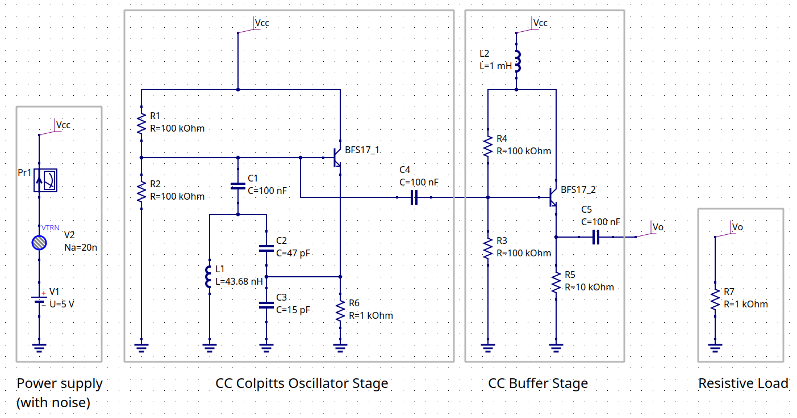
I buffered the oscillator stage with a common collector amplifier so there would be enough current gain to run undisturbed even with a 50 ohm load. I opted to only use an RF choke for the buffer stage since the oscillator stage won't be drawing much current and thus shouldn't cause any disturbance to Vcc.

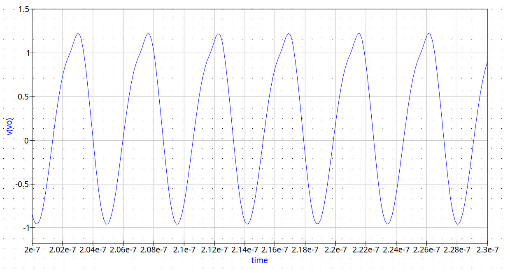
I aimed to get a small amount of clipping so I could get a somewhat prominent second harmonic.

## Layout
---

|  | 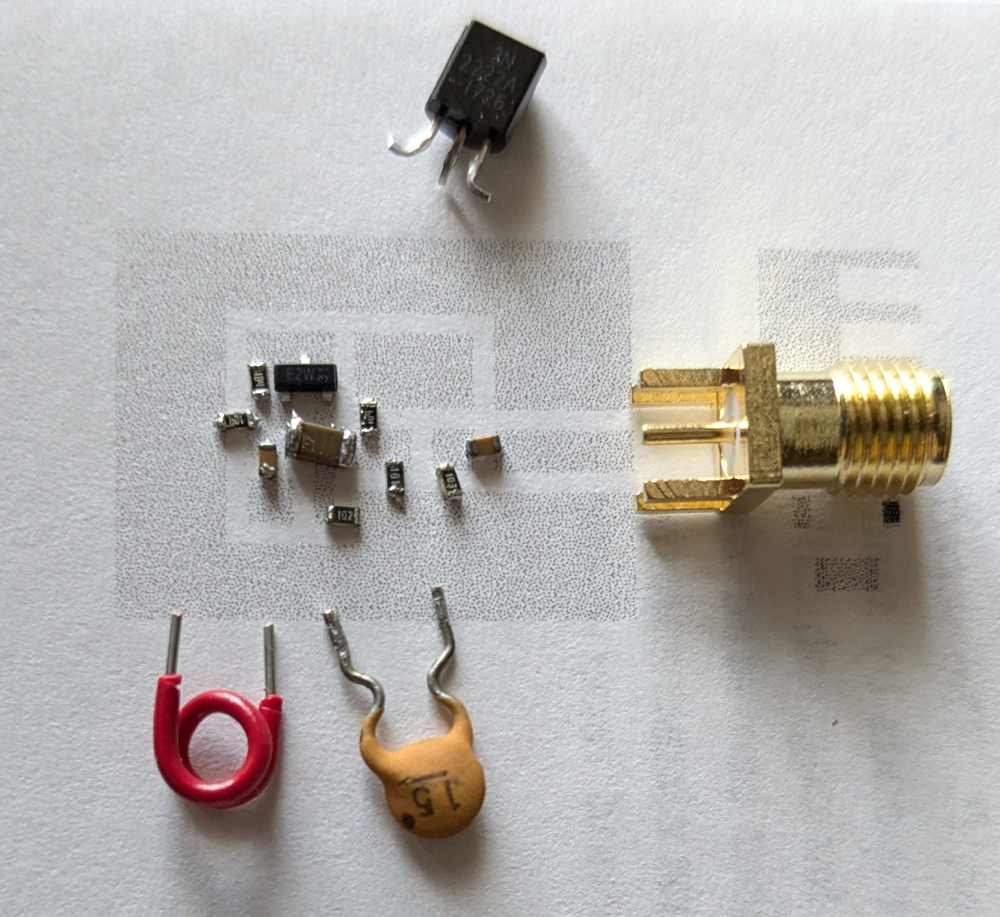 |
| ------------------------------- | ----------------------------------- |
For the layout I started off by drawing up correctly sized prefabs for each of the components I would be using. I then arranged the components in the shape of the circuit and started drawing islands for each node. After a bit of tweaking to make sure the gap is consistent everywhere, I printed it out to check the scaling and make sure everything would correctly fit. Once I was confident with the layout i moved onto the actual build.
## The Build
---

| 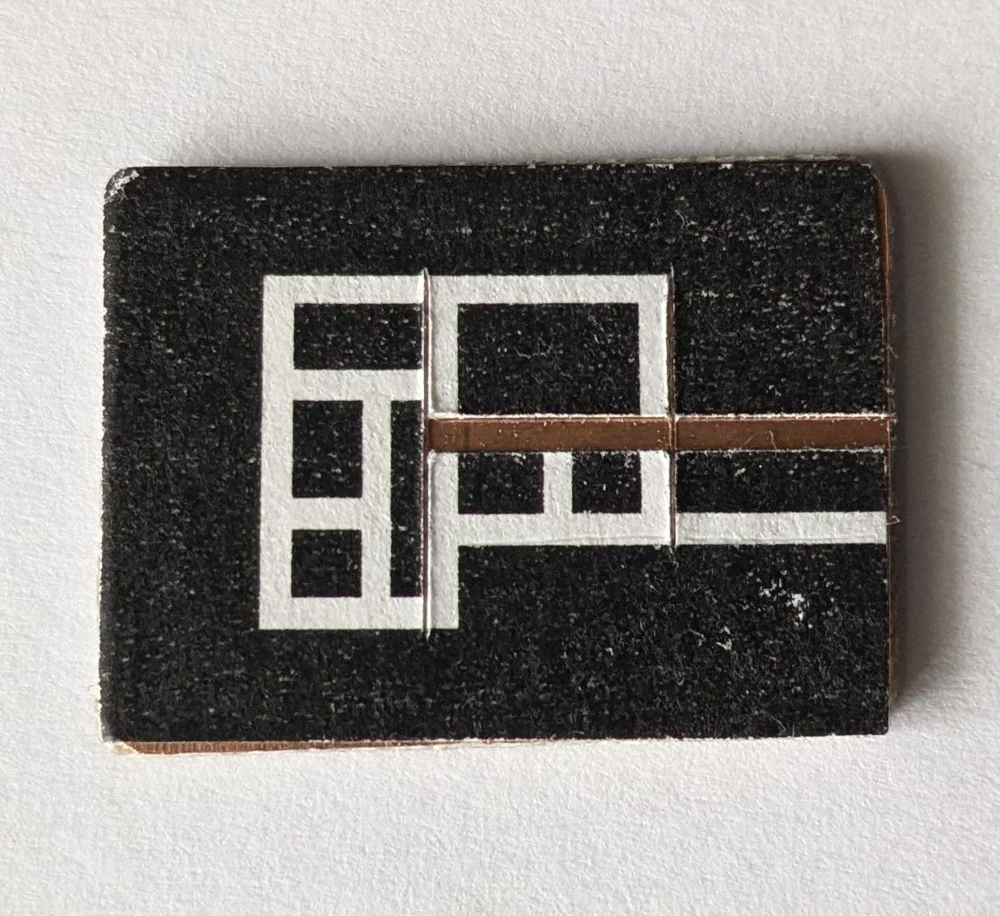 | 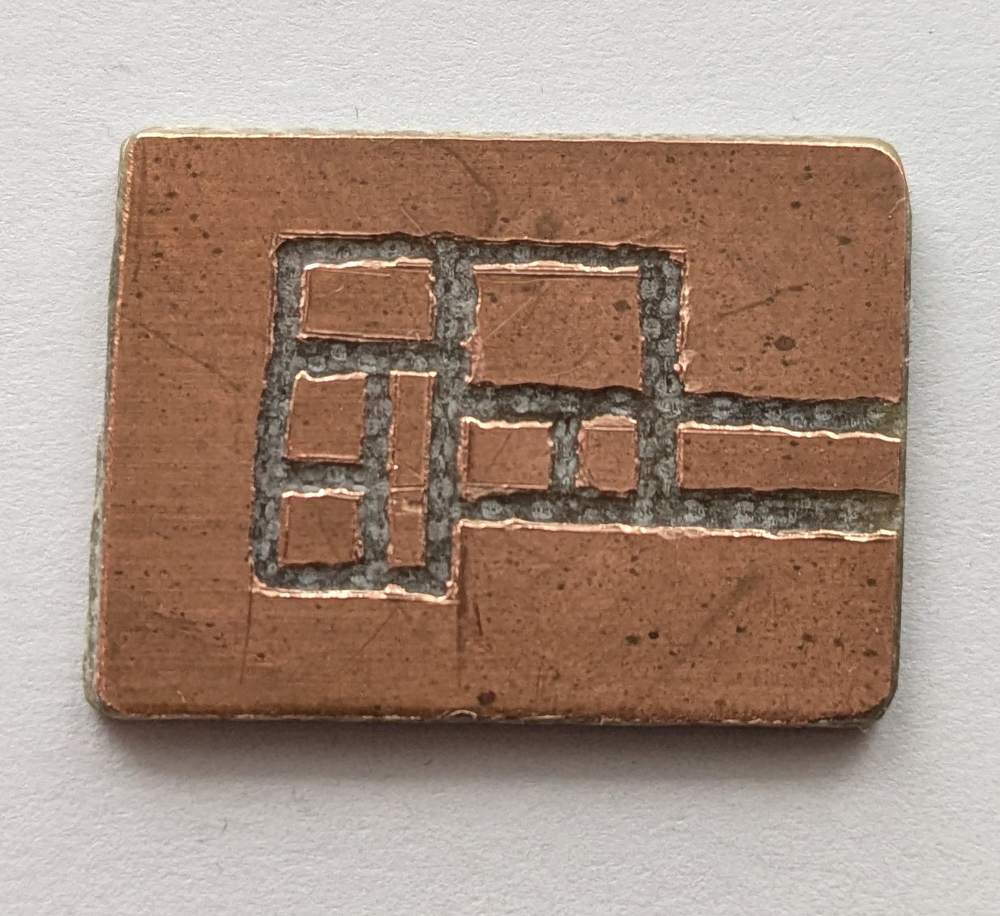 |
| --------------------------------- | ------------------------------- |
I glued the printout onto a 2 sided copper clad board and initially tried going at it with a box cutter, that didn't end up going so well so I switched to a dremel which did quick work of the copper. Not the cleanest job, but good enough.

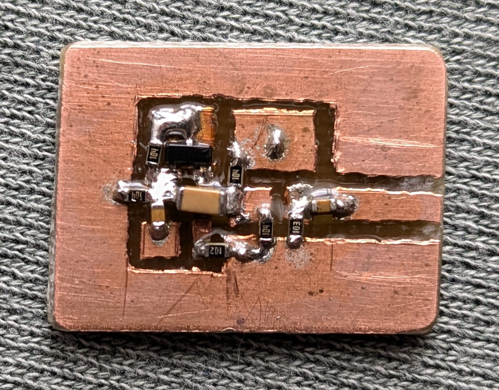
I started off by soldering all the surface mount components so that any larger components don't get in the way. I purposefully used a larger capacitor to couple the oscillator to it's buffer stage so that I could use it to bridge over the track without needing a two layer board.

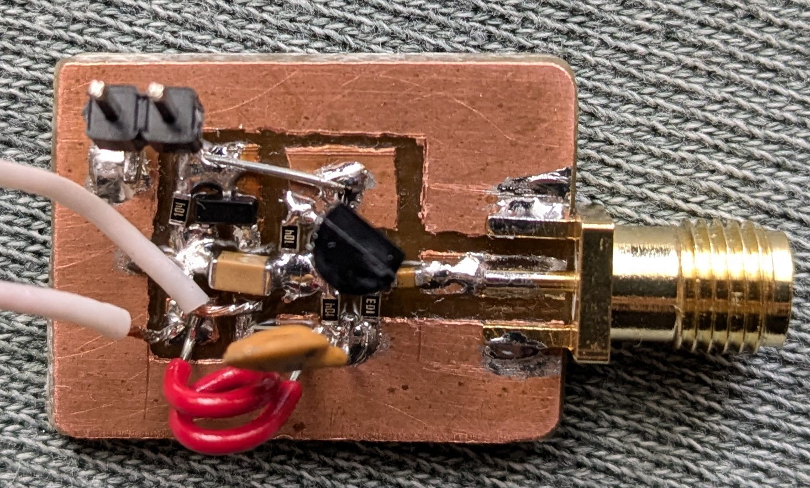
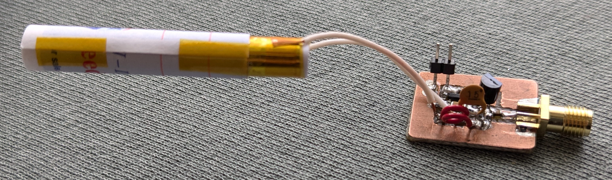
I then added all the non SMD components. For the CC (common collector) buffer stage transistor I initially used a 2N2222 since I've a much more plentiful supply of them than BFS17. For the tank circuit I used a 15pF capactior, an air core inductor I estimated to be around 10nH, and a crude attempt at a homemade variable capactior. I opted to leave out the RF choke between the two stages simply because I was lazy. I just bridged the gap with a wire instead.

Once assembled, I power it at 5V through a 1kOhm resistor and make sure the current draw is less than the 5mA the resistor would allow (it drew about 1mA which is in line with the simulation). I check for any shorts and make sure the bias voltages look fine. The moment of truth comes, I start up my spectrum analyzer (an RTLSDR and [spektrum](https://github.com/pavels/spektrum)) and... Nothing.

What I believe happened here is, since I used the 2N2222 - which isn't rated to work above 300MHz - for the buffer stage, it was putting too heavy a load on the oscillator and damping out any oscillations.

Before I switched out the transistor I swapped out the variable capacitor for a static 47pF capacitor. Still no dice, I probably could have kept the variable cap but I ended up going another less finicky route to dial in the frequency.

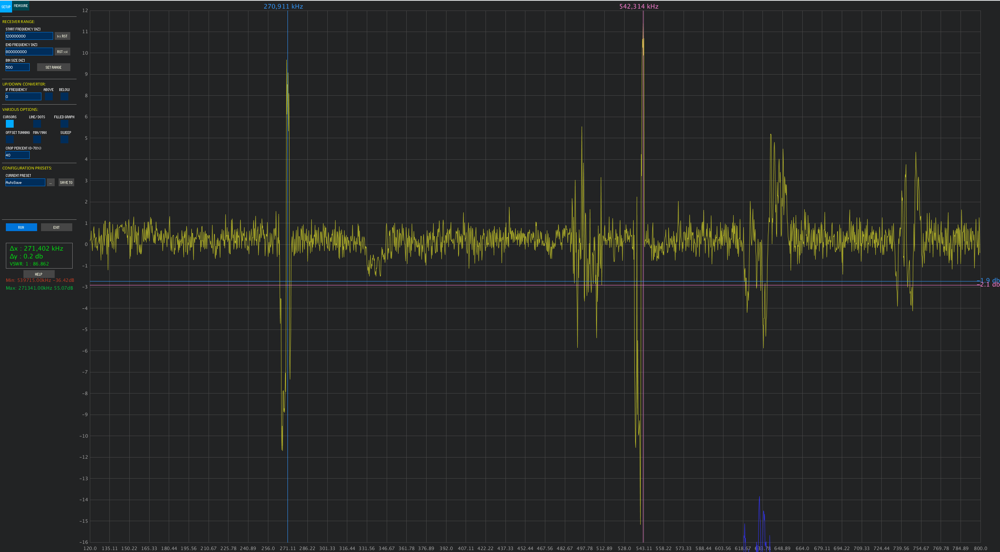
With the 2N2222 swapped for a faster switching BFS17 It worked! But as expected, at the wrong frequency. By looking at the frequency I could estimate the value of my inductor; Assuming the capacitors are perfect and no parasitics. I calculated an inductance of 26.2nH which is pretty far off from what I thought it would be.

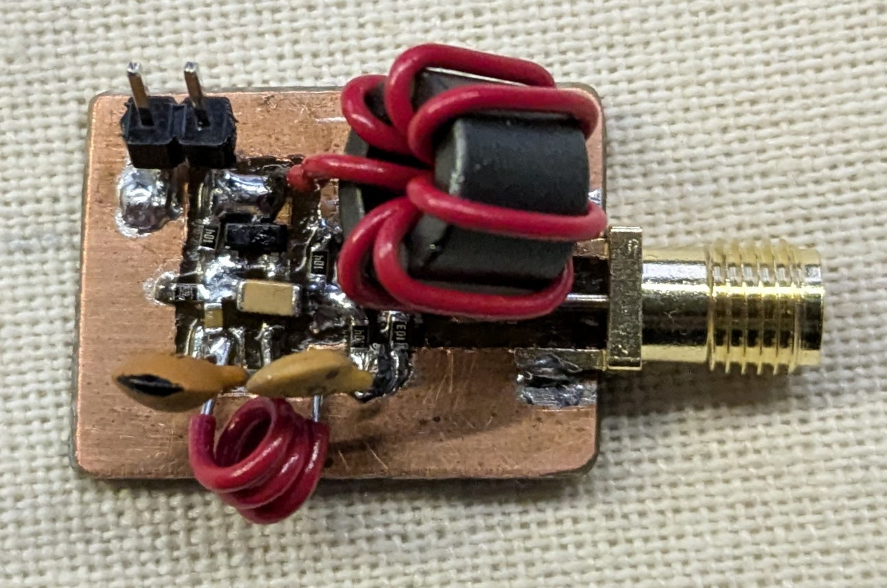
After dealing with stability issues for an hour I finally caved and put in the RF choke like I was supposed to do to begin with. This immediately resulted in a much cleaner and more stable signal - oh how annoying past me can be sometimes.

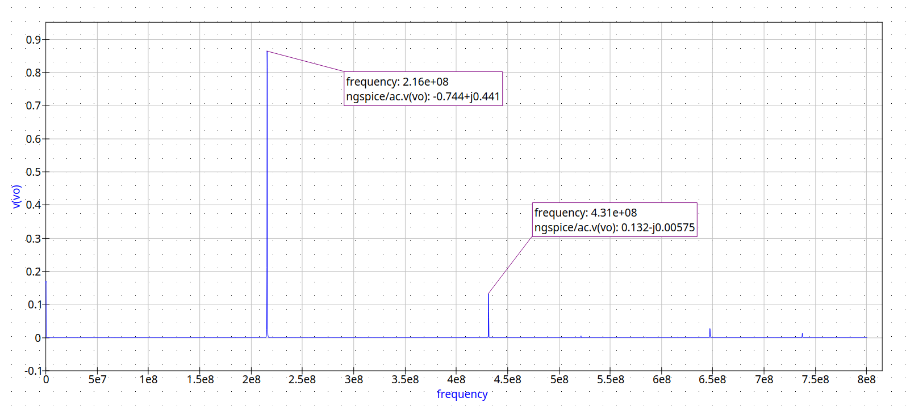
From the simulation I knew there would be a bit of clipping causing a visible second harmonic but what I wasn't expecting was for said harmonic to be about as strong as the fundamental. Note: It probably isn't really as strong as the fundamental but looking at signal strength using a RTLSDR shows it as about the same and that's the only tool I have that is able to measure signal strength.

It was interesting to see just how sensitive the frequency is to my hand or other conductive objects in close proximity.

Because of the strength of the second harmonic I had the idea to bring it down to 433MHz instead of bringing the fundamental up. Bringing it down ends up being easier since I can use a bigger value for the inductor and keep the capacitors the same size.

To dial in the frequency I used the inductor. I calculated that I would need 3 turns to bring the frequency down slightly lower than 433MHz. I then stretched out the inductor - lowering its inductance and increasing the resonant frequency - until it resonated at 433MHz.

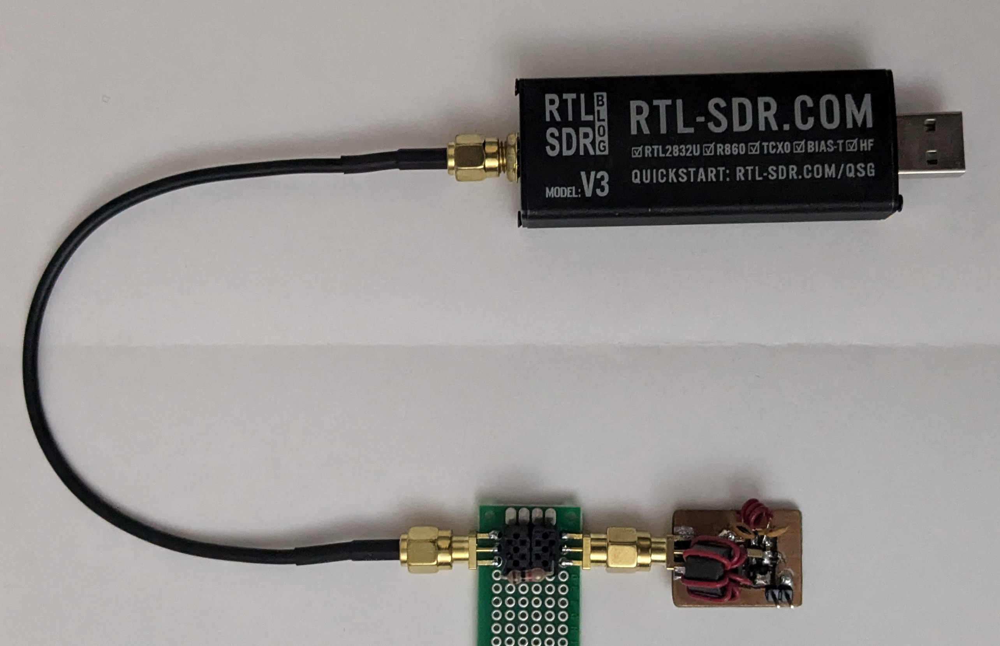
All of this testing was done with no load and the RTLSDR sensing nearby with an antenna. So as you would expect, the moment I put a 50 Ohm load on it, it stops oscillating. I played around with putting 100 and 1k Ohm resistors in series to see what it would take to get it to oscillate, it oscillated with 1k but not with 100. This should be fine since im not looking to be making a high power transmitter anyway.

With the oscillator stable and working, I decided to test if it would work at 4.3V which would be required if i want to switch it on and off with a transistor. Although as I write this I realize the current draw is low enough it could probably be switched directly from a microcontroller's GPIO pin. Well nonetheless it still oscillates at 4.3V although theres very little leeway since it stops oscillating at around 4.1V

|  |  |
| ---------------------------- | ---------------------------- |
All in all i'm quite pleased with the results, I still have to figure out an enclosure so mitigate frequency drift as well as an output filter to get rid of the 216MHz oscillation; But the hard part is done.
#### Update
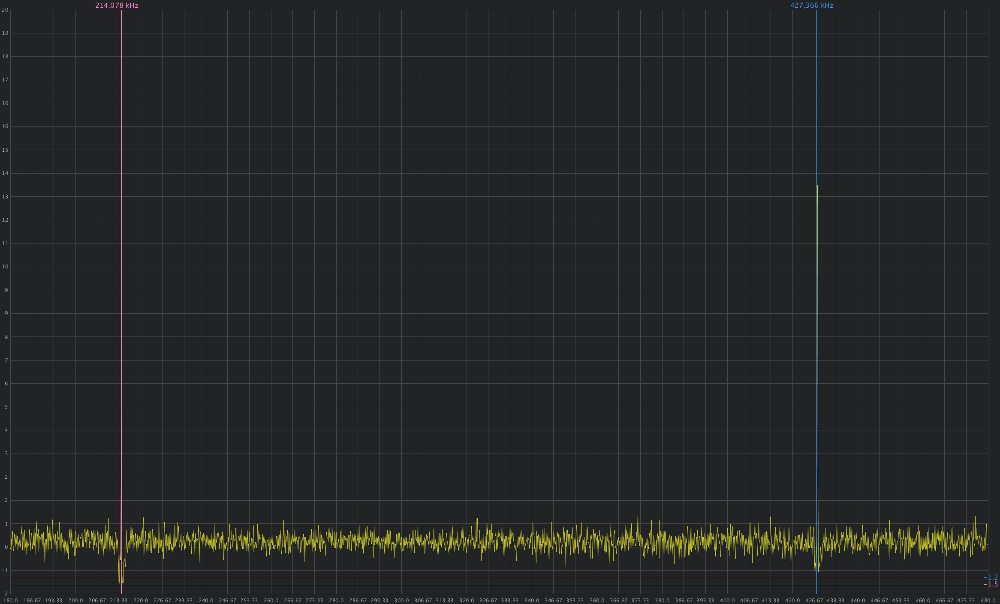
I refined the design a bit to oscillate more reliably with a load applied. I brought the biasing of the oscillator stage transistor down by changing the bottom resistor to a 50k, swapped around the 47pF and 15pF capacitors so we have less oscillation feedback, and made the buffer stage take its input from the emitter of the oscillator stage instead of the base. These modifications make it so it will oscillate even with a 50 ohm load applied albeit not as cleanly as a 1k load.
